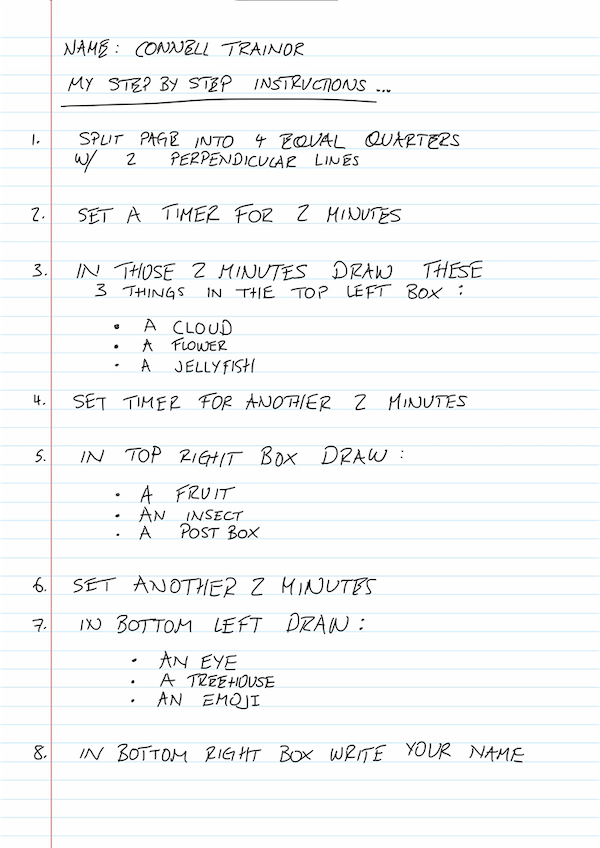
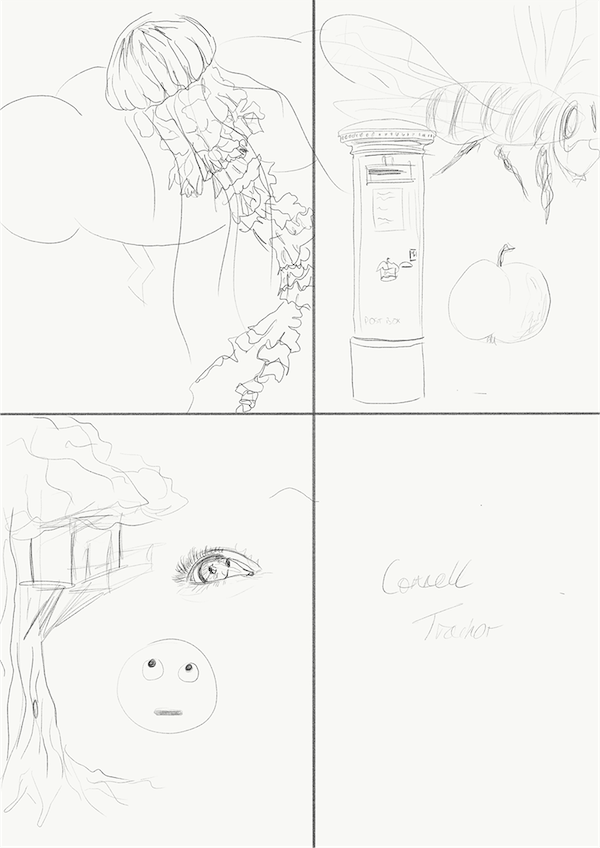
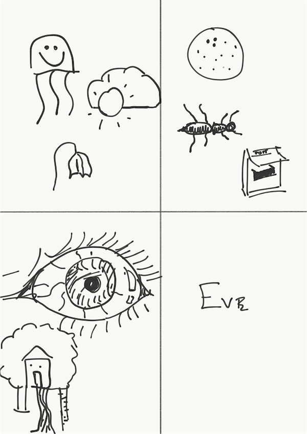
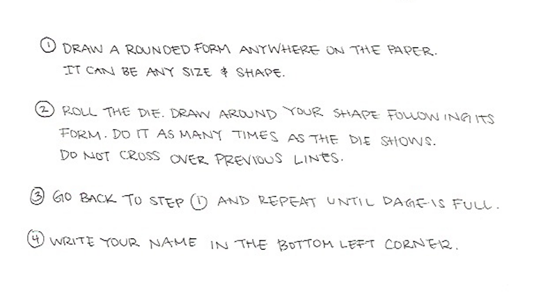
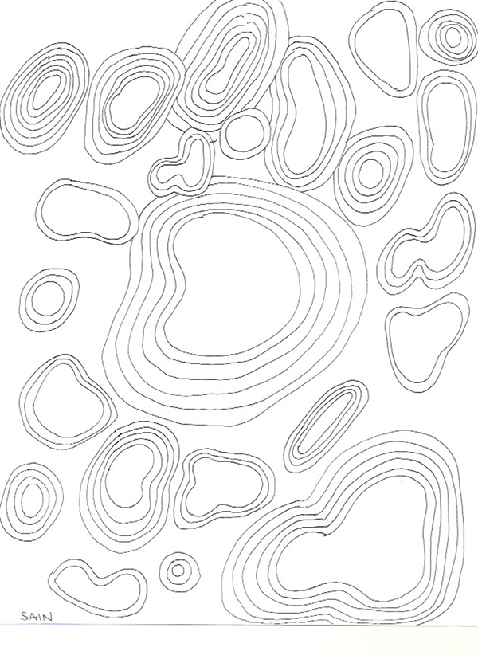

[Previous Section: Reading](1_READING.md)

# Module 1: Exercise

## Coding for Humans

One of the most important words in computing is [**algorithm**](https://en.wikipedia.org/wiki/Algorithm). An **algorithm** is a set of **step-by-step instructions that determines the behavior of a computer system**. The word actually comes from the name of a Persian scholar in the 9th century, [al-Khwarizmi](https://en.wikipedia.org/wiki/Muhammad_ibn_Musa_al-Khwarizmi). ([Image Source](https://commons.wikimedia.org/wiki/Category:Muhammad_ibn_Musa_al-Khwarizmi#/media/File:Al-Khwarizmi_portrait.jpg))

Everything we can do on a computer works because of human-made algorithms. But algorithms don’t only exist in computing. Algorithms predate computing in many forms. We can think  of many sets of instructions as everyday algorithms. This includes **recipes**, **IKEA instructions** and the **directions from your home to school**.

One historical artifact that is algorithmic and is a direct ancestor to computing is the [jacquard loom](https://en.wikipedia.org/wiki/Jacquard_loom), first demonstrated in 1801. This type of loom is used for weaving fabrics with complex patterns. ([Image source](https://commons.wikimedia.org/wiki/File:Jacquard_loom_p1040320.jpg))

The loom simplified the process by using **punch cards** that determined how the machine would weave the fabric. The cards could be chained together and fabrics could be created and recreated using  the device. These punch cards are a precursor to computer programming and data storage devices.

*Yoko Oko. Grapefruit, 1964.*

In visual art [Jean Tinguely](http://www.theartstory.org/artist-tinguely-jean.htm), [Sol Lewitt](http://massmoca.org/sol-lewitt/), and [Yoko Ono](https://www.moma.org/explore/inside_out/2015/07/15/happy-belated-birthday-to-yoko-onos-grapefruit/) are excellent examples of artists whose work relies heavily upon algorithms, systems, or sets of instructions. 

*Sol Lewitt. Wall Drawing #1136, 2004.*

## Instructions

Your assignment is based on the [Conditional Drawing Manifesto](https://conditionaldesign.org) by Luna Maurer, Edo Paulus, Jonathan Puckey, and Roel Wouters.

1. Create **a set of step-by-step instructions** that a person can follow to create a work of art. **Remember:** these instructions are **for a person, not a computer**, so you can be as creative and "out there" as you'd like.
2. Your instructions should be **hand written** on a single **8.5 x 11 inch sheet of paper**.
3. Design the instructions so that it takes approximately **10 minutes to complete
   the drawing**.
4. **Create an example** of what you think a person would draw if they followed your instructions.
5. Find a partner in your life. Give them the set of instructions and ask them to complete the work of art. ***Note: Don't let them see your example.***
6. **Compare** the example you created with the example your partner created. Can you explain any differences?

## Student Examples

**Note:** The example I provide are meant to only give you an idea of what's expected. **Do not copy them. All of your ideas in this course must be original.** Create your own approach to all assignments.

The following is a student example used with permission:

Instructions by Connell Trainor:

Follow the instructions yourself:

Ask a partner to do the instructions without showing them your own results:

Instructions by Sain Lim:

Follow the instructions yourself:

Ask a partner to do the instructions without showing them your own results:

## Rubric

| Criteria                                                     | Points |
| ------------------------------------------------------------ | ------ |
| **Conceptual Understanding** - Instructions take approximately 10 minutes to complete. - Created an example where instructions are followed. | 1 pts  |
| - Worked with a **partner** and **included results**.        | 1 pts  |
| **Presentation** - Instructions are handwritten on a single 8.5 x 11 inch paper. - Submission was **scanned clearly** and **oriented correctly** as a PDF, JPG, or PNG. | 1 pts  |

[Next Section: Project](3_PROJECT.md)

