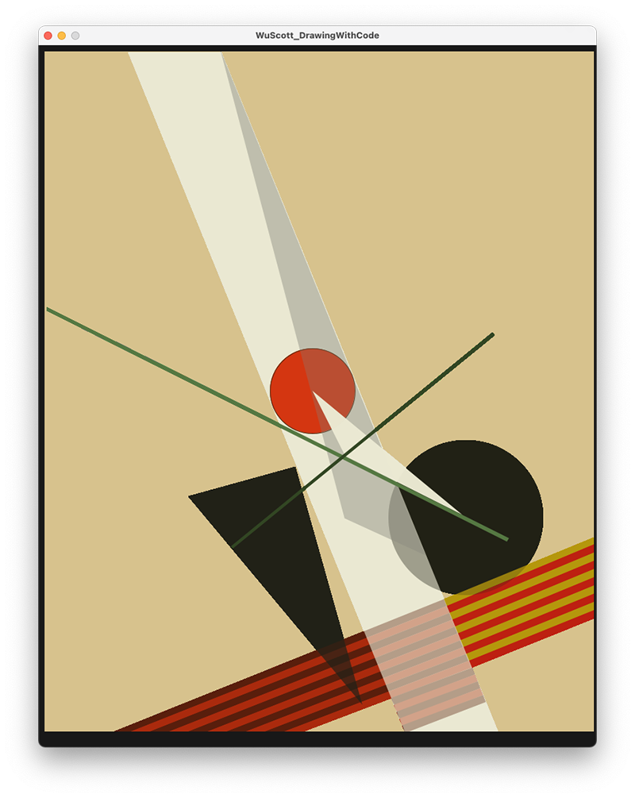

[Previous Section: Project](2_EXERCISE.md)

# Module 1: Project

Painting by Sophie Taeuber-Arp, 1932.

## Drawing with Code

Drawing with code means interpreting the  shapes, colors and sizes in a work and translating them into a language  the computer understands.

## Instructions

### Step 1: Find a Painting to Work From

For this assignment we will be drawing inspiration from the history of geometric abstraction in painting. You will be doing some online research and **choosing one painting** as the inspiration for your first Processing sketch. You may choose any painting you find online that involves geometric abstraction or hard edge painting. Some artists I recommend you search are: László Moholy-Nagy, Kazimir Malevich, Sophie Taeuber-Arp, Sarah Morris, Maya Hayuk, Robert Delauney, Victor Vasarely, Vera Molnar, and Bridget Riley.

### Step 2: Select an Interesting Crop

First **select an** **interesting/ambitious crop**, then load it into a program such as Adobe Photoshop or GIMP to read the color and coordinate data.

### Step 3: Gather Coordinate and Color Data Using Photoshop or GIMP

Use as many of the following functions for drawing as you can to get sufficient practice: `strokeWeight()`, `noStroke()`, `line()`, `quad()`, `rect()`, `ellipse()`, `arc()`, and `beginShape()`,  `endShape()`, `curveVertex()`, and `vertex()`. For color, use the following functions: `background()`, `fill()`, `noFill()`,  and `stroke()`.

The goal for this project is to translate the painting into code.

## Student Example

**Note:** The examples I provide are meant to only give you an idea of what's expected. **Do not copy them. All of your ideas in this course must be original.** Create your own approach to all assignments. Copies will receive no credit.

The following is a student example used with permission:

Sketch by Scott Wu.

## Rubric

**Note:** Code must function in order to earn credit.

| Criteria                                                     | Points |
| ------------------------------------------------------------ | ------ |
| **Technique** - **Uses the shape functions learned** in the module to create an interesting crop of an image that enables an exploration of as many of the required functions as possible (at least 5). | 1 pt   |
| **Conceptual Understanding** - **Uses color to accurately reproduce the image** selected and demonstrates knowledge of using color in code. - Includes png or jpg of **original painting**. | 1 pt   |
| **Presentation** - Code has a clear, descriptive **header**. - Code is helpfully **commented** for your future self. - Code is **auto-formatted** (Command-T on macOS, Ctrl-T on Windows) so that tabs are correct. - The code is presented neatly **without** commented out code. | 1 pt   |

[Next Section: Module 2](../2_ColorLoopsAnimation/README.md)

