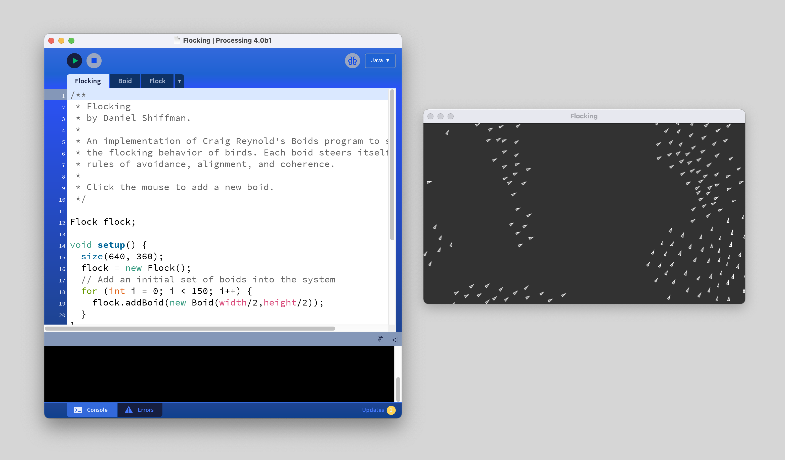

# Module 1: Drawing with Code

## Introduction

In this course you will learn how to code by doing something you already know how to do: draw! Whether you doodle, only practiced art when you were little, or are a practicing artist, making art is something most people can relate to. Learning how to code using existing metaphors helps ease the process into programming.

The framework we'll be using for this course is called Processing. It's a framework designed at the MIT Media Lab by Casey Reas and Ben Fry. Processing is based on the Java language and you can do anything you can do in Java in Processing.

For this course we'll be working in a lot in the Processing Development Environment (PDE). The PDE is a simplified development environment that makes it easy to get started programming.

[Next Section: Reading](1_READING.md)

