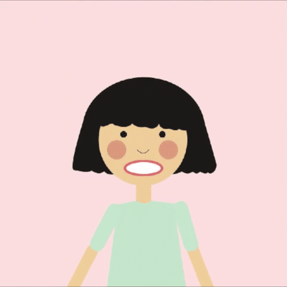

[Previous Section: Exercise](2_EXERCISE.md)

# Module 3: Project

Mask by Evelyn Askew.

## Mask

In the previous module you learned how to draw using code, but what you drew was a **static image**. In this assignment we're going to bring your previous sketch to life and **learn how to animate** and **make it interactive** using **touch** input.

## Instructions

Based on the excellent assignment by [Lorenzo Bravi](http://www.creativeapplications.net/processing/bla-bla-bla-iphone-of-processing-sound/) and in the manner of [Bruno Munari](http://www.creativeapplications.net/processing/bla-bla-bla-iphone-of-processing-sound/) or [Osamu Sato](https://motherboard.vice.com/en_us/article/d734ja/the-most-elusive-video-game-creator) (watch the second video in the article), **design a minimal geometric face**.

Like Munari and Sato, **emphasize the geometry and patterns of the abstraction**, rather than creating a “cartoon” or “illustration.” Think about the  personality of the character as much as how you want it to look. The  personality of the character and how it looks should be related in your  mind.

Here are the steps you should take:

1. **Plan your face’s animations on paper before you start coding.** You will scan and turn in this plan for part of your grade.
2. As you design, keep in mind that you’ll be **performing the character** for the class in an online video.
3. What is your **character's story**? Write a short script that you will perform (see more info below).
4. Next, write code in Processing to **draw your face**.
5. (**Optional** if you want to start *without* the template first for planning.) Then, **create a variable called `volume`** in your sketch and connect it to various components of your mask. You can do this by hand without microphone input to test it at first. For example, maybe a `volume` of 0.0 is a neutral face and a `volume` of 1.0 is an extreme face. Setting this volume by hand will enable you to plan your sketch out.
6. (**Optional** if you want to start *without* the template first for planning.) Extend your code by **updating the variable called `volume` when the touch moves from the left to the right side of the screen**. You can do this with `mouseX.` Use this variable to change different aspects of your face.
7. **Incorporate a `reVolume` and `eaVolume` variable.** `reVolume` is the **re-mapped volume**. Maybe a range of 0.0 to 1.0 is not large enough for your mask's movements. Use the `map()` function to remap it. This will be your `reVolume` variable. Sometimes input from the microphone can lead to sudden, unsmooth movements. You can smooth the movements out by incorporating `lerp()`. This will be your **volume with easing**. This will be your `eaVolume` variable. **NOTE:** You can make as many `reVolume` and `eaVolume`-like variables as you need for different parts of your maks. Just name them differently.
8. Finally, **insert your program into [this template](https://github.com/masoodkamandy/Processing_Mask_Template/archive/refs/heads/main.zip)** which gives you access to the microphone. **IMPORTANT:** You will need to **rename your folder to remove the `-main` from the title**, otherwise Processing will not see all of the files. You will work with the `v` variable which returns a float from 0.0 to 1.0. `print()` the value so you can see what kinds of numbers you are working with and what you'll need to do to get your desired result.

**Note:** Bluetooth microphones can sometimes cause problems. It's recommended to use the internal microphone on your computer or a wired microphone.

## Import Minim Library

To use this template **you will need to add a library called *Minim*** to Processing. To add this library go to:

`Sketch > Import Library... > Add Library` 

Search for *Minim*. Click **Install Library**.

## Script

You will write a script for your mask that is at least **250 words** and perform it in a recorded video. You may only use music if you sing it yourself. The script language **must be your original writing**. Do not use existing stories, language, or music in your script.

Turn in the script along with your project as a **PDF**.

## Capture and Share a Recording of Your Performance

Use a video sharing service like YouTube to upload your creation and share your link.

## Student Examples

**Note:** The examples I provide are meant to only give you an idea of what's expected. **Do not copy them. All of your ideas in this course must be original.** Create your own approach to all assignments. Copies will receive no credit.

The following are student examples used with permission:

Mask by Vivian Rowe.

Mask by Dana Nugumanova.

## Rubric

**Note:** Code must function in order to earn credit.

| Criteria                                                     | Points |
| ------------------------------------------------------------ | ------ |
| **Technique** - Provided **template** file is used. - **Minim library** is properly added to Processing. | 1 pt   |
| - Volume is controlled using the **`map()`** function. - **Easing** is implemented with the **`lerp()`** function *or* with the easing code provided in the template (see instructions and example code). | 1 pt   |
| **Conceptual Understanding** - You created a storyboard and sketches to plan out your mask and its motion. - You wrote a script of at least 250 words for your performance and included it with your files. | 1 pt   |
| **Presentation** - Code includes **instructions** and runs without any adjustment or intervention. - You uploaded a **.mov** or **.mp4** video file of your project. - Optional: You provided a **link** to your project on a **video sharing website**. | 1 pt   |
| - Code has a clear, descriptive **header**. - Code is helpfully **commented** for your future self. - Code is **auto-formatted** (Command-T on macOS, Ctrl-T on Windows) - The code is presented neatly **without** commented out code.Code is helpfully commented for your future self. | 1 pt   |

[Next Section: Module 4](../4_Functions_and_Expanded_Cinema/README.md)

