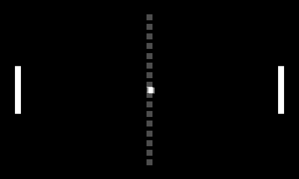

[Previous Section: Reading](1_READING.md)

# Module 6: Exercise

## Game Elements



Footage of the real Pong game [can be seen here](https://www.youtube.com/watch?v=fiShX2pTz9A).

## Introduction

While it wasn't the [first video game](https://www.bnl.gov/about/history/firstvideo.php), Pong is widely regarded as the video game which **marked the beginning of the home video game industry in the 70s**. It was a relatively simple game based on tennis where **two paddles** were used to hit a **ball** back and forth. Whenever a player missed the ball, the other player would get a **point**. Whoever gets ten points first wins.

Pong was released by Atari in 1972, first in the arcades and then as a home unit that connected to TVs. It was ultimately made available for the Atari 2600.

A digital tennis game like Pong is a great way of thinking through the idea of **object oriented programming**. It allows us to use physical metaphors to organize code in a logical, and consistent way for humans to understand.

## Instructions

We're going to divide the creation of a digital tennis game into 3 challenges and then put them all together to create the final game.

#### **Challenge 1: Paddle**

Create a single paddle using the **`rect()` function** with the following characteristics:

- The **paddle height** should be **20 px tall** and **100 px wide**
- The paddle should be positioned **20 px from the left edge**.
- **Use `mouseY`** to control the y-position of the paddle.
- The paddle should stay **fixed in its x-position**.
- Use the **`constrain()` function** to constrain your y-position so that the paddle does not move off the screen.

#### **Challenge 2: Ball**

Create a white ball using the **`ellipse()` function** with the following characteristics:

- The ball **diameter** should be **20 px**.
- The ball should **start on the left edge** and move at a **random angle** to the right.
- The ball should **detect when it hits the top and bottom of the canvas** and **bounce**.
- If the ball hits the right side, it should **restart** on the left side again.
- Your **bounce detector** could be a **boolean function**. Another way of saying this is to **write a function that returns a boolean value**. Feed the location of the ball in along with its diameter and if it returns true that means the ball has hit a wall (top or bottom) and you can reverse the direction. False means no the ball hasn't hit a wall, so nothing happens.

#### **Challenge 3: Collision**

Use your ball code and modify it in the following way:

- Create a ball that **bounces only on the top and bottom.**

- If the ball hits the right side, it **resets and shoots from the left side at a random angle and speed**.

- Draw a **200 px square in the center** of the screen.

- Write a **collision detection boolean function** called `hitPaddle()` in which you feed the location and size of the rectangle  and the location of the ball. This function will detect when the ball is inside the square and give a visual indication by changing the fill  color of the square. You will use an **if else statement** to change the fill of the square.

  Your boolean function will look a little like this when you use it (it can be written on a single line. Multiple lines used here for space. This is only pseudocode, so you'll still need to write the correct format when defining and calling a function.):

```swift
hitPaddle(paddleX, paddleY,
          paddleWidth, paddleHeight,
          ballX, ballY, ballRadius)
```

## **File Submission Instructions**

Only 1 file submission per group is required. When submitting your main zip file, it should be named like this:

`Last1_Last2_Last3_Exercise.zip`

Inside of this folder there should be 3 separate Processing projects:

1. `ball`
2. `paddle`
3. `collision`

## Student Examples

The following are student examples used with permission:

Coming soon.

## Rubric

| Criteria                                                     | Points |
| ------------------------------------------------------------ | ------ |
| All 3 challenges have been completed and function properly with expected behavior. | 10 pts |
| Code is written in a way that it can be reused. Use of global variables has been minimized, and when appropriate functions and/or objects have been implemented. | 10 pts |
| Code is helpfully commented for your future self.            | 5 pts  |

[Next Section: Project](3_PROJECT.md)

