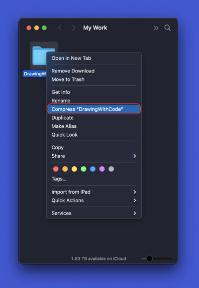

# Frequently Asked Questions

## Table of Contents

- [Turning In Your Assignments](#Turning-In-Your-Assignments)
  - [What deliverables are expected with each programming assignment?](#What-deliverables-are-expected-with-each-programming-assignment)
  - [What should I name my zipped exercise and project files?](#What-should-I-name-my-zipped-exercise-and-project-files)
  - [What header should I always place at the top of my code?](#What-header-should-I-always-place-at-the-top-of-my-code)
  - [How should I archive my own projects?](#How-should-I-archive-my-own-projects)
- [Processing](#Processing)
- [macOS](#macos)
  - [How do I take a screen grab?](#how-do-i-take-a-screen-grab)
  - [How do I create a zip file from a folder?](#how-do-i-create-a-zip-file-from-a-folder)

## Turning In Your Assignments

### What deliverables are expected with each programming assignment?

Unless otherwise stated, **you should be zipping your entire Processing sketch folder and turning that in**. Separating the .pde from its folder can cause problems. The name of your folder **must be the same** as the name of your main `.pde` file. For example, if my sketch is called `RamirezJoana_DrawingWithCode.sketch`, then the folder must be called `RamirezJoana_DrawingWithCode`.

**Important:** *Do not* just turn in a `.pde` file. Projects turned in like this will receive no credit.

[Table of Contents](#Table-of-Contents)

### What should I name my zipped exercise and project files?

Project names should be in the following format:

`LastFirst_AssignmentName.zip`

**Note:** Change the title of the zip file *after* it has been zipped. This preserves the original name of the project.

[Table of Contents](#Table-of-Contents)

### What header should I always place at the top of my code?

```java
/*
 * Course: ART 22  - Computer Programming for the Arts
 * Assignment: Assignment Name
 *
 * by First Last
 * 
 * Initiated: 1/1/1
 * Last updated: 1/1/1
 * 
 * CITATIONS: List all sources you used for this assignment.
 *
 * NOTE: This is where you write any notes you would like
 * to leave yourself or others using your code.
 * 
 * */
```

[Table of Contents](#Table-of-Contents)

### How should I archive my own projects?

The work you do in this class is precious and depending on where you end up going after this course, it may be useful to you in the future. It's important to store and keep track of your work in a system that works for you. Here is one suggestion for a system that might be useful to you.

When starting a project, rename the external folder of the template with the following format:

`sketch_YYYYMMDD_ProjectName`

Processing requires filenames to start with alphanumeric characters, so that's why we place `sketch` at the beginning. For example, a project called *Drawing Machine* that I started on October 20, 2021 would have an external folder called:

`sketch_20211021_DrawingMachine`

This ensures that when you navigate to a folder, all of your files are in order by the date that you started them and you don't have to spend a lot of time searching around a long list.

[Table of Contents](#Table-of-Contents)

## Processing

### What does it mean when there are multiple `.pde` files in a folder?

Processing gives programmers the option of organizing their code with additional tabs. **The tabs add extra `.pde` files to your sketch's folder**. If you have a folder with multiple `.pde` files in it (your mask template for exampe) **it's important to maintain the file relationship inside the folder**, so do not separate the files.

Processing will treat **the file name that matches the sketch's folder name** as the main project file.

When Processing compiles a project that has multiple `.pde` files in it, it treats it like one long file, so having mutliple files is really just for humans to be able to code in a more organized way.

[Table of Contents](#Table-of-Contents)

## macOS

### How do I take a screen grab?

In macOS you can take a screen grab with a keyboard combination.

**Command-Shift-3** takes a screen grab of your **entire screen**.

**Command-Shift-4** takes a screen grab of a **selected area**.

Pressing the **space bar** after you've entered selection mode will allow you to **capture a window**.

Your image files will save to your desktop.

Add a **Control** to either of the above methods and you will **copy your screen grab to the clipboard** rather than create a file.

[Table of Contents](#Table-of-Contents)

### How do I create a zip file from a folder?

In macOS you can create a zip file by **right or control-clicking any file** and choosing **Compress File**.



[Table of Contents](#Table-of-Contents)

[Next Section: Module 1](1_DrawingWithCode/README.md)
